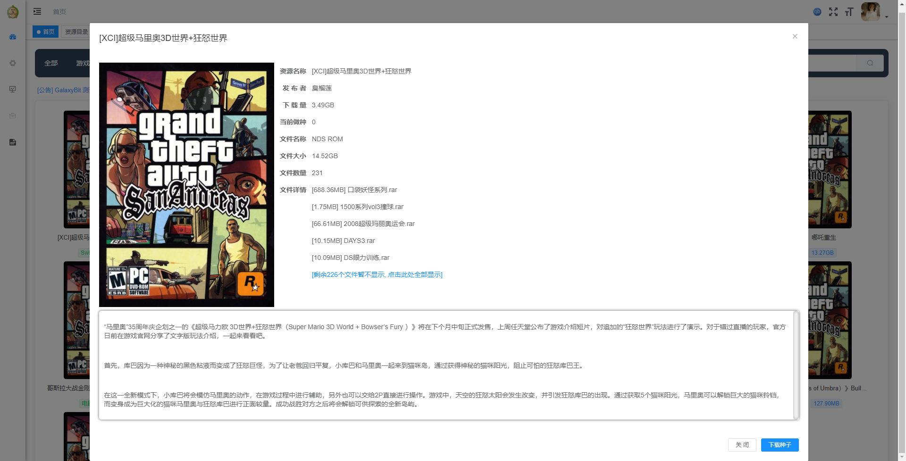
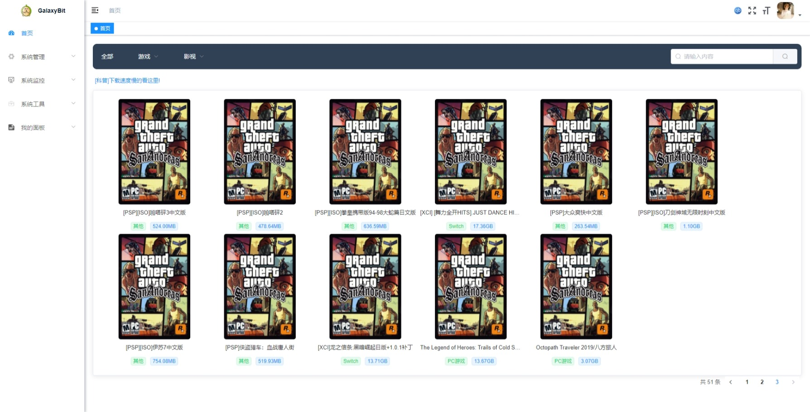
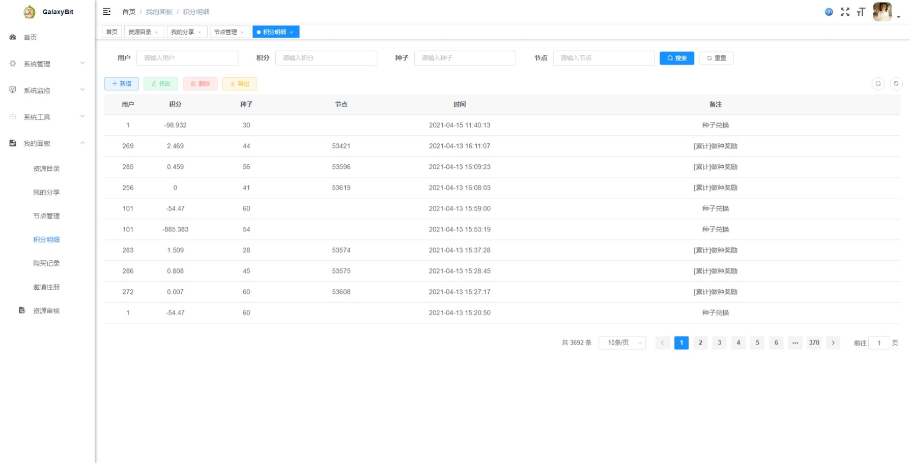
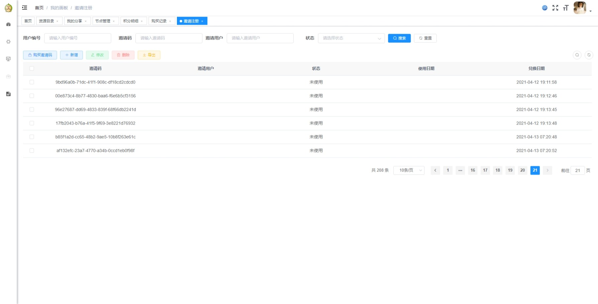
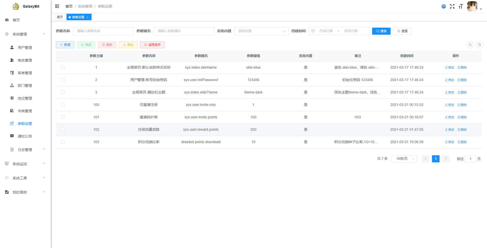

## 介绍

GalaxyBit 是一款基于若依框架(分离版)的PT系统.

## 说明

很久之前就一直想做一套PT系统,这次终于如愿了..本人并非资深PT用户,对PT的一些规则及了解不够透彻.所以..系统可能会有各种问题啊...

## 主要功能介绍

1. 发布种子
2. 积分制(采用了国内常用的魔力值计算公式[点此处查看介绍](https://www.sohu.com/a/342448586_100173319))
3. 邀请注册
4. 种子兑换

## 未完成功能

1. 反作弊
2. 对辅种的统计
3. 积分与流量值的转换

## 后续更新

目前暂无后续更新计划

## 部署步骤

1. 打包成 jar 运行
2. 将前端放到nginx中(配置可以参考以下内容)

```
server {
        listen       80;
        server_name  localhost;

		location / {
            root   /var/www/html/dist;
			try_files $uri $uri/ /index.html;
            index  index.html index.htm;
        }
		
		location /prod-api/{
			proxy_set_header Host $http_host;
			proxy_set_header X-Real-IP $remote_addr;
			proxy_set_header REMOTE-HOST $remote_addr;
			proxy_set_header X-Forwarded-For $proxy_add_x_forwarded_for;
			proxy_pass http://localhost:8080/;
		}

		location /profile/ {
		    proxy_pass http://localhost:8080/profile/; 
		}

		location /announce{
			proxy_set_header Host $http_host;
			proxy_set_header X-Real-IP $remote_addr;
			proxy_set_header REMOTE-HOST $remote_addr;
			proxy_set_header X-Forwarded-For $proxy_add_x_forwarded_for;
			proxy_pass http://localhost:8080/announce;
		}

        error_page   500 502 503 504  /50x.html;
        location = /50x.html {
            root   html;
        }
    }

```

## 其他说明

没有优化!没有缓存!

## 截图









